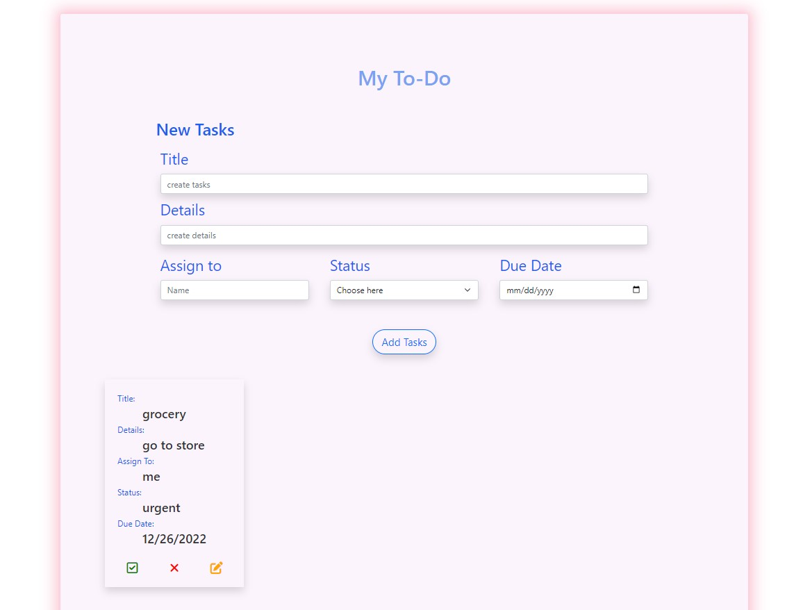
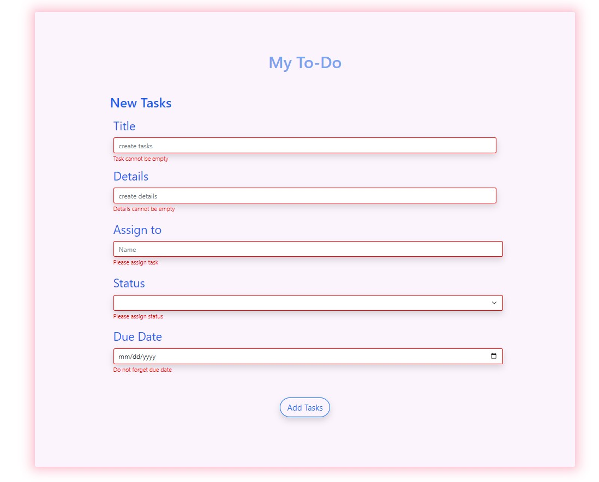

# Group11-Tasks

- This a group collaboration project with Generation USA - Jr. Web Development. 

## Table of contents

- [Overview](#overview)

  - [The challenge](#the-challenge)
  - [Screenshot](#screenshot)
  - [Links](#links)

  - [Built with](#built-with)

- [Author](#author)

### The challenge

Users should be able to:

- user should be able to add the tasks
- user should see error message if the task input is missing
- user should be able to delete tasks
- user should be able to update/edit tasks
- user should be able to check when tasks is done

### Screenshot

- Solution URL: [github code](https://github.com/goldreb/Group11-Tasks)
- Live Site URL: [netlify live site](https://group11-taskslist.netlify.app/)

### Built with

- Semantic HTML5 markup
- CSS custom properties
- Bootstrap

## Author

- Github -
- Goldiluck Rebollido -  [@goldreb](https://github.com/goldreb)
- Jeongwoon Eun-Jimenez - [@Tigerwon]()
- Kacie Lim - [@sfkacie]()
- Xavier Malone - [@thakiddx](https://github.com/thakiddx)
- Jamaal Shazier - [@JShaz](https://github.com/JShaz)
- Mishack Sam-Hinton - 

